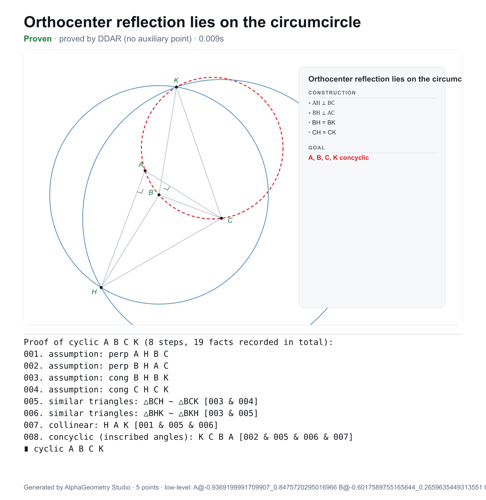

# GeoSolver

**Photograph or describe an olympiad geometry problem → get a full, numbered
proof and a figure — in your browser, inside Claude, or on the command line.**



GeoSolver wraps a fast, from-scratch **Rust** reimplementation of the
**DDAR** symbolic engine from
[AlphaGeometry2](https://www.jmlr.org/papers/v26/25-1654.html)
([`alphageometry-rs/`](alphageometry-rs/)) in a small, self-contained product.
You give it a problem in words or as a photo; Claude turns it into the engine's
`.geo` language; the engine proves it (with a language-model-free auxiliary-point
search, or a classical Euclidean proof for length goals) and draws the figure;
you get the result as a live page, a **PDF**, or a **PNG**.

* **No API key.** Translation runs on **your local Claude subscription** via the
  `claude` CLI — nothing is billed to an API account. The prover and renderer are
  pure Rust and need no network at all.
* **Pure-Rust rendering.** SVG figures are rasterised to PNG (resvg) and exported
  to PDF (svg2pdf) headlessly — no browser, no Python.
* **Three front ends, one engine.** A web app, an MCP server for Claude
  Desktop/Code, and a CLI.
* **Shortest-proof search.** Ask for the *shortest* proof (a time budget, default
  20 s) and it compares every proof it can reach and keeps the one with the fewest
  steps — regardless of how many auxiliary constructions it uses.

---

## How it works

```
 photo / description
        │
        ▼
   Claude (your subscription)  ──►  .geo program
        │                            A B C = triangle
        │                            H = orthocenter(A, B, C)
        │                            K = reflect(H, line(B, C))
        │                            prove cyclic(A, B, C, K)
        ▼
   alphageometry-rs DDAR engine
     • deductive closure  • auxiliary-point search  • classical Euclidean prover
        │
        ▼
   numbered proof  +  SVG figure   ──►   PDF / PNG
```

Relational goals (`collinear`, `concyclic`, `perp`, `cong`, products/ratios of
lengths …) go through the DDAR closure and, if needed, the auxiliary-point
search. **Absolute-length goals** (a specific length, a sum of squares like
`AC² + BD² = 144`) are proved by a **classical Euclidean** prover that writes a
numbered, theorem-citing proof (Pythagoras, Thales, …).

Every result is strictly Euclidean: **proved** means a proof whose every step
cites a theorem or a hypothesis. A length goal no prover reaches is never
reported as proved — it is checked in 48 independently sampled figures and
shown as *Not proven — holds numerically* (evidence, not a proof), or as
*Refuted* with a counterexample. The web API's solve response carries this as
`status`: `"proved"`, `"holds-numerically"`, `"refuted"` or `"not-proved"`,
with `proved: true` only for `"proved"`.

---

## Quick start

Prerequisites: Rust 1.88+ ([rustup](https://rustup.rs), or your distro's/Nix's `cargo`). Node is only needed for the
optional AI-translation step (below).

### 1. Web app

```sh
./run.sh               # Linux/macOS: builds release, serves on :8787
./run.ps1              # Windows: same, and opens the browser
```

or manually:

```sh
cargo run --release -p ag-studio -- serve --port 8787
# open http://127.0.0.1:8787
```

Type a problem (or paste a `.geo` program, or drop a photo) and press **Solve**.
Download the proof + figure as PDF or PNG.

### 2. Inside Claude Desktop / Claude Code (MCP)

Add this to your Claude Desktop config
(`%APPDATA%\Claude\claude_desktop_config.json` on Windows,
`~/Library/Application Support/Claude/claude_desktop_config.json` on macOS; see
[`claude_desktop_config.example.json`](claude_desktop_config.example.json)),
then restart Claude Desktop:

```json
{
  "mcpServers": {
    "alphageometry": {
      "command": "<repo>/target/release/agstudio",
      "args": ["mcp"]
    }
  }
}
```

Now paste a problem (or a photo) into Claude and ask it to prove it. Claude
reads it, writes the `.geo`, calls the `solve_geometry` tool, and shows you the
proof and figure — and can save a PDF with `export_report`. (Build the binary
first: `cargo build --release -p ag-studio`.)

For **Claude Code**:

```sh
claude mcp add alphageometry -- "<repo>/target/release/agstudio" mcp   # agstudio.exe on Windows
```

### 3. Command line

```sh
# Solve a .geo program (or a file) and print the proof:
cargo run --release -p ag-studio -- render alphageometry-rs/examples/orthocenter_reflection.geo

# Solve + export a combined proof-and-figure document:
agstudio render alphageometry-rs/examples/euler_line.geo --title "Euler line" --pdf euler.pdf --png euler.png

# Spend up to 20s finding the SHORTEST proof (fewest steps; auxiliary count irrelevant):
agstudio best alphageometry-rs/examples/olympiad/ortho_reflection_midpoint.geo --budget 20

# Photograph/describe a problem (needs the claude CLI — see below):
agstudio translate --image problem.jpg --solve --pdf proof.pdf
agstudio translate "In triangle ABC prove the medians are concurrent" --solve
```

---

## Enabling AI translation (photo / natural language)

The prover, figures, and PDF/PNG work with **no setup**. To describe problems in
words or photos (rather than writing `.geo` yourself), GeoSolver drives
the local **Claude CLI**, which runs on **your Claude subscription** — no API key:

```sh
npm install -g @anthropic-ai/claude-code
claude            # then run /login and sign in with your Claude subscription
```

That's it — the web app's **Describe** mode and the `translate` command now work.
Optional environment overrides:

| Variable | Effect |
| --- | --- |
| `AGSTUDIO_CLAUDE_BIN` | path to the `claude` executable (if not on `PATH`) |
| `AGSTUDIO_CLAUDE_MODEL` | model to translate with (e.g. `opus`, `sonnet`) |

Inside Claude Desktop/Code (the MCP path) no CLI is needed — Claude itself does
the reading and writes the `.geo`.

---

## The `.geo` language

You describe *how points relate*; the engine samples a concrete figure — you
never write coordinates. Full grammar and worked examples:
[`ag-studio/prompts/geo_grammar.md`](ag-studio/prompts/geo_grammar.md); the
construction/relation catalogue is also printed by
`cargo run -p alphageometry-rs --bin ddar -- --constructions`.

```geo
# Incenter–excenter (trillium) lemma
A B C = triangle
I = incenter(A, B, C)
M = meet(line(A, I), circumcircle(A, B, C))
prove cong(M, B, M, I)
```

Dozens of worked `.geo` examples live in
[`alphageometry-rs/examples/`](alphageometry-rs/examples/), and the canonical
AlphaGeometry problem corpora are preserved under [`corpus/`](corpus/).

---

## Architecture

A Cargo workspace:

| Crate / path | Role |
| --- | --- |
| [`alphageometry-rs/`](alphageometry-rs/) | the DDAR engine (deductive closure, auxiliary-point search, classical Euclidean length prover, SVG figures) — see its own [README](alphageometry-rs/README.md) |
| [`ag-studio/`](ag-studio/) | this product: `engine` (in-process solve wrapper), `render` (SVG→PNG/PDF, report page), `translate` (photo/NL→`.geo` via the Claude CLI), `web` (axum server + UI), `mcp` (MCP server) |
| [`corpus/`](corpus/) | AlphaGeometry problem sets & definitions (for testing / reference) |

The `agstudio` binary has five subcommands: `render`, `best`, `translate`, `serve`, `mcp`.

## Build & test

```sh
cargo build --release            # the agstudio binary + engine
cargo test                       # engine unit/integration tests + ag-studio tests
cargo run -p alphageometry-rs --bin ddar -- --bench   # engine speed on the IMO set
```

The release build targets the host CPU (`.cargo/config.toml`), appropriate for a
locally-run prover; delete that file for a portable binary.

## Deploying on a Linux server

A single binary (UI, fonts, and grammar are baked in) plus one SQLite file for
accounts and history, hardened for public exposure — see **[deploy/DEPLOY.md](deploy/DEPLOY.md)**. The fastest path:

```sh
cp deploy/.env.example deploy/.env          # set AGSTUDIO_BASIC_AUTH, AGSTUDIO_PUBLIC_HOST
docker compose -f deploy/docker-compose.yml up -d --build
```

Security defaults: the server **refuses to start on a public interface without
authentication** (a shared password is enough — guests need no account, and
browsers enter it once on a password page that keeps them signed in, while API
clients can still use HTTP Basic), and enforces a per-IP rate limit, a
concurrency cap, a body-size limit, and CSP/security headers. Config is all environment variables
([reference](deploy/DEPLOY.md#environment-variables)). Options include Docker +
nginx (TLS), plain `docker run`, or a hardened `systemd` unit.

## Credits & license

Built on a Rust port of the DDAR core of Google DeepMind's AlphaGeometry2.
Apache-2.0. Not an official Google/DeepMind product. Bundled fonts: DejaVu
(public-domain-style license).
